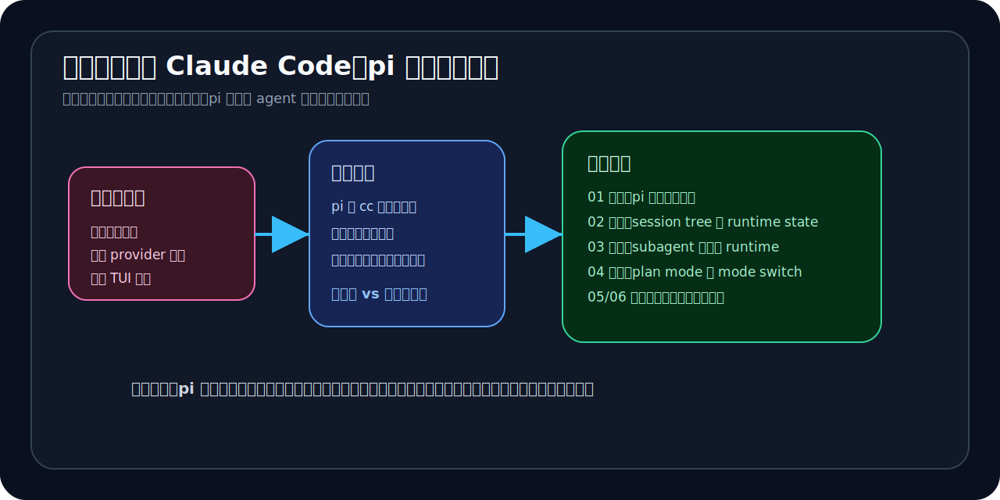

# 00｜这不是另一个 Claude Code：为什么 pi 值得单独研究

如果只看表层，`pi` 很容易被读成“又一个 terminal coding agent”。

它有 TUI，有 session，有 provider，有模型选择，有 read / write / edit / bash，也有 extensions、skills、prompt templates、themes。你完全可以按普通方式去读它：先看怎么安装，再看有哪些命令，再看支持哪些 provider，最后整理一份功能表。

但这样会把 `pi` 最值得研究的地方读丢。

这本小书不打算把 `pi` 写成一份功能说明书。

它只想回答一个问题：

> 为什么 `pi` 不是另一个 Claude Code，而是代表了另一种 agent 产品路线？

更具体一点：

> `pi` 的价值，不在于它比 Claude Code 多了什么功能，而在于它把 agent 做成了一个可编程宿主。

这就是全书的入口。

---

## 1. README 已经把路线说白了

`pi` 的 README 第一段其实已经给了答案。

它不是先说自己是“最强 coding agent”，也不是先列一长串内建工作流，而是这样定义自己：

> Pi is a minimal terminal coding harness. Adapt pi to your workflows, not the other way around, without having to fork and modify pi internals.

这句话里最重要的词不是 terminal，也不是 coding，而是 harness。

也就是说，`pi` 一开始就没有把自己放在“官方替你做好所有工作流”的位置上。

它强调的是：

- 你可以把 `pi` 适配到你的 workflow；
- 不是让你的 workflow 反过来迁就 `pi`；
- 你不需要 fork 和修改 `pi` 内核，也能扩展它。

紧接着 README 又说：

> Pi ships with powerful defaults but skips features like sub agents and plan mode.

这句更关键。

subagent 和 plan mode 明明是现在 coding agent 里很重要的能力，但 `pi` 选择不把它们做进 core。

这不是因为它不知道这些能力重要。

更像是一个产品选择：

> core 提供足够强的底座，高级工作流通过 extension / package 长出来。

所以如果一上来就按“它有没有内建 subagent、有没有内建 plan mode”去打分，就会读歪。

`pi` 真正值得看的，不是它默认塞了多少功能，而是它把高级工作流应该长在哪里这件事重新打开了。

---

## 2. 这本书不做大全

因为目标不同，所以这本书不做大而全。

它不打算写成：

- 安装教程；
- provider 大全；
- 命令大全；
- TUI 操作手册；
- monorepo 全量源码漫游；
- 每个 extension 示例的使用说明。

这些当然都有价值，但不是这本小书的主线。

如果把它写成大全，读者最后会得到很多材料，却不一定能抓住 `pi` 和 Claude Code 最大的差异。

所以这里刻意收窄范围。

这本书只回答三个问题：

1. `pi` 和 Claude Code 最大的差异点到底是什么？
2. `pi` 的真正卖点是什么？
3. 为什么它对会自己搭 agent 工作台的人特别值得研究？

这三个问题背后，其实只有一个总判断：

> Claude Code 更像一个已经做得很强的官方 agent 成品，而 `pi` 更像一个让你自己长出 agent 工作流的宿主。

后面的所有章节都只是在证明这句话。

---

## 3. 差异不在功能表，而在高级工作流的位置

如果按功能表看，很容易陷入这种比较：

- 谁支持更多 provider；
- 谁的 TUI 更好；
- 谁有 plan mode；
- 谁有 subagent；
- 谁的 session 管理更强；
- 谁内建了更多命令。

但 `pi` 和 Claude Code 的核心差异，不在这些单点功能上。

更重要的问题是：

> 高级工作流应该优先长在官方 core 里，还是长在宿主暴露出来的 runtime surface 上？

Claude Code / cc 更像前一种路线。

它把很多高级能力做进产品主干：内建 agent、fork path、官方 workflow、强默认体验。用户得到的是一个成熟的强成品 agent。

`pi` 更像后一种路线。

它保留一个相对克制的 core，然后把 extension、session、provider、UI、compaction、tool surface 暴露出来，让高级工作流在宿主层继续生长。

所以这不是简单的“谁更强”。

更准确地说，这是两种产品哲学：

- 强成品 agent：官方把工作流做强，用户直接用；
- 可编程宿主：官方提供 runtime surface，用户继续长自己的系统。

这就是为什么 `pi` 值得单独研究。

---

## 4. 阅读顺序

这本书建议按下面的顺序读。

### 01｜pi 不是强成品 agent，而是可编程宿主

这一章先定总论点。

它回答：为什么 `pi` 不能被读成“又一个 Claude Code”？为什么它的核心价值不是多一个功能，而是让用户不 fork 内核也能把自己的工作流做成正式 runtime？

### 02｜为什么 pi 要把 session 做成树，而不是聊天记录

这一章讲底座。

如果 `pi` 是宿主，它就不能只把 session 当聊天记录。session tree 让一次 agent 工作变成可分叉、可回放、可压缩、可被 extension 注入状态的 runtime log。

### 03｜pi 的 subagent 不是 prompt 分身，而是独立 runtime 的委派

这一章讲第一种高级工作流外化路线：委派。

subagent 不是在主上下文里假装多个角色，而是 extension 启动独立 `pi` 进程，用独立上下文、prompt、tools、model 去执行任务，再把结构化事件流带回主会话。

### 04｜plan mode 不是内建 planner，而是宿主切出来的一种工作模式

这一章讲第二种高级工作流外化路线：模态切换。

plan mode 不起一个官方 planner agent，而是在同一个主 runtime 里切换工具池、bash allowlist、context layer、todo state 和 session persistence。

### 05｜当 tool、UI、provider、compaction 都能外化，agent 产品会变成什么

这一章把 extension surface 收起来。

它说明 `pi` 的 extension 不只是加 tool，而是覆盖 tool、UI、provider、compaction、session lifecycle 等多个关键层。agent 产品因此从固定功能集合，变成更像宿主平台。

### 06｜为什么 pi 代表另一种 agent 产品路线

最后一章收束产品判断。

`pi` 不是为了所有人，也不一定比强成品 agent 更省心。它更适合会自己搭 agent 工作台、愿意治理权限和流程、需要把内部系统接进 agent 的用户。

---

## 5. 这本书最终想留下什么

如果只保留一句，这本书想留下的是：

> `pi` 的卖点，不是它比 Claude Code 多了什么功能，而是它把 agent 做成了可编程宿主。

这句话看起来简单，但它会改变阅读方式。

你不再只问：

- 它内建了什么？
- 它默认支持什么？
- 它功能是不是比别人多？

而会开始问：

- 它把哪些层开放成 runtime surface？
- 它允许用户在哪些位置继续长工作流？
- 它如何保存长期工作状态？
- 它如何处理高级工作流的外化？
- 它把哪些治理责任交给了用户？

这才是读 `pi` 最有价值的角度。

所以，这不是一本 `pi` 功能手册。

它更像一本产品路线导读。

目的不是告诉你“pi 怎么用完所有功能”，而是帮你看清：

> 在强成品 agent 之外，agent 产品还可以被做成一个可编程宿主。
