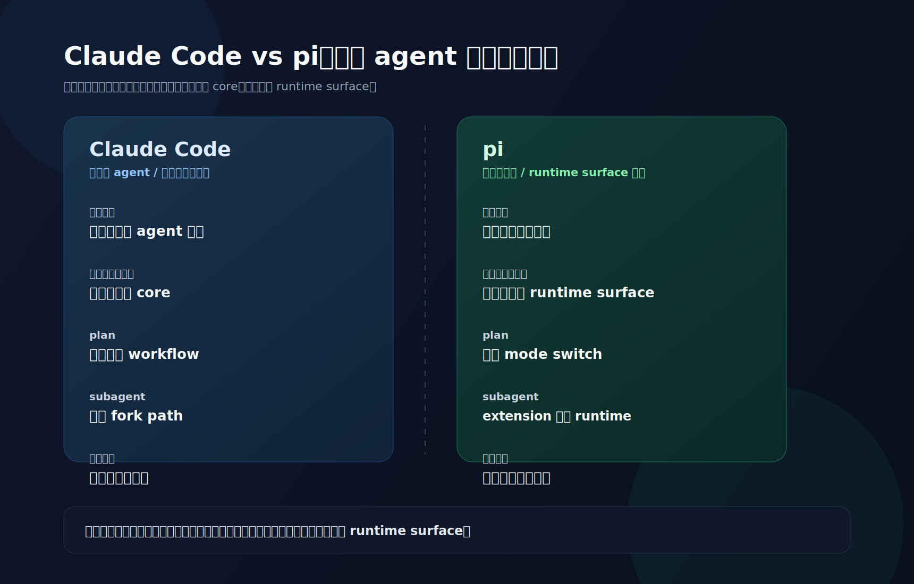

# 2026-04-23 pi 不是强成品 agent，而是可编程宿主 v1

## 这篇看什么

这篇不把 `pi` 当成“又一个 terminal coding agent”来介绍。

它只回答一个问题：

> **为什么 `pi` 最值得研究的地方，不是它又做了一套 agent 功能，而是它把 coding agent 做成了一个可编程宿主？**

先把这个问题说清楚，后面再看 session、subagent、plan mode、provider，才不容易读偏。

---

## 先给结论

一句话说：

> **Claude Code 更像一个已经做得很强的官方 agent 成品，而 `pi` 更像一个让你自己长出 agent 工作流的宿主。**

所以 `pi` 的真正卖点，不是：

- 比 cc 多了什么功能；
- 又支持了多少模型；
- TUI 多炫。

而是：

> **它让你不必 fork agent 内核，也能把自己的工作流做成正式 runtime。**

这也是它对系统型用户有研究价值的原因。

---

## 先看一张路线对照图

这篇的判断，可以先压成一张图来看。

看这张图时，可以先抓 3 个点：

- 先看左右两列的**产品定位**：一个更像官方做强的 agent 成品，一个更像让工作流继续生长的宿主。
- 再看中间几行的**工作流位置**：差异不在有没有这些能力，而在这些能力优先长在 core，还是长在 runtime surface。
- 最后看底部结论：这不是 feature checklist 的竞争，而是两条不同的 agent 产品路线。

这张图先只回答一个问题：

> **高级工作流，究竟应该优先长在官方产品里，还是长在宿主暴露出来的 runtime surface 上？**

下面把这张图背后的判断拆开。

---

## 如果先按普通方式读，会把它读错

如果先从这些角度进：

- CLI 长什么样；
- 支持哪些 provider；
- 有哪些命令；
- TUI 怎么操作；
- 默认工具有哪些。

最后很容易得到一份“pi 功能说明书”。

但这样会错过它更有意思的地方：

> `pi` 不是在拼命往 core 里塞更多高级工作流，而是在重新安排 **高级工作流应该长在哪里**。

它想做的不是一个封闭成品，而是一个最小但足够强的 coding-agent host。

---

## 第一层证据：README 自己就把产品哲学说白了

`packages/coding-agent/README.md` 里有两句很值得看：

> Pi is a minimal terminal coding harness.

以及：

> Pi ships with powerful defaults but skips features like sub agents and plan mode.

这两句放在一起，意思很明确。

### 1. 它把自己定义成 harness / 宿主

不是“最完整的 coding assistant”，而是：

- minimal terminal coding harness

也就是说，它一开始强调的就不是：

- 功能一站式齐全

而是：

- 这是一个可承载你自己工作流的底座

### 2. 它故意不把 subagent / plan mode 做进 core

这不是没做完，而是明确的产品取舍：

- 默认能力已经够强；
- 但高级工作流不必优先固化进产品内核；
- 用户可以通过 extensions / packages 自己长出来。

所以它的路线天然就和 cc 不一样。

---

## 对照 cc：cc 是“内建工作流优先”

如果看 cc 这边的几个锚点：

- `cc/src/tools/AgentTool/builtInAgents.ts`
- `cc/src/tools/AgentTool/loadAgentsDir.ts`
- `cc/src/tools/AgentTool/forkSubagent.ts`

你会发现 cc 的思路更像：

> **官方先定义一套比较强的 agent runtime 和 worker 体系，再把高级工作流做进产品主干。**

比如：

- built-in agents 是产品主干的一部分；
- plan / explore / verification 都是官方 worker 角色；
- fork/subagent 有明确内建路径；
- prompt cache sharing、fork child rules 这些优化都直接写进 core。

也就是说，cc 的一个卖点是：官方已经替你把高级工作流做得很强。

这是强成品路线。

---

## 对照 pi：pi 是“宿主能力优先”

而 `pi` 这边，最有代表性的不是 built-in worker，而是 extension runtime 本身。

源码锚点：

- `packages/coding-agent/src/core/extensions/types.ts`
- `packages/coding-agent/src/core/extensions/loader.ts`
- `packages/coding-agent/src/core/extensions/runner.ts`
- `packages/coding-agent/examples/extensions/README.md`

第一轮源码阅读里，最明显的结论是：

> extension 在 `pi` 里不是“插件附属物”，而是宿主正式暴露出来的能力表面。

它能做的事远远不止“注册一个工具”：

- register tool；
- register command / shortcut / flag；
- 改 UI：footer / header / widget / overlay / editor；
- 参与 session lifecycle；
- 参与 compaction；
- 注册 provider；
- 改 input / autocomplete / working indicator。

如果一个系统把这些层都开放给 extension，它表达的意思就不只是：

- “你可以给我的产品打一点补丁”

而更像是：

- “你可以把自己的 runtime 行为接进我的宿主里”

这就有了平台感，而不是单纯的插件感。

---

## 第二层证据：`pi` 的高级工作流不是塞进 core，而是长在 extension 层

这一点在两条线里看得很清楚。

## 1. Subagent：不是内建魔法，而是 extension 里的委派器

锚点：

- `packages/coding-agent/examples/extensions/subagent/index.ts`
- `packages/coding-agent/examples/extensions/subagent/agents.ts`
- `packages/coding-agent/examples/extensions/subagent/README.md`

这套实现不是在主进程里模拟多角色，而是：

- 发现 agent definitions；
- 给子 agent 写临时 system prompt 文件；
- `spawn` 独立 `pi` 进程；
- 用 `--mode json --no-session` 跑子任务；
- 主会话消费子进程的结构化事件流；
- 支持 single / chain / parallel 三种执行形态；
- 对 project-local agents 做显式信任确认。

这说明它不是 prompt cosplay，而是宿主之上的受控委派 runtime。

重点不在“它也能 subagent”，而在于：

- 它把 subagent 做成 extension 层工作流；
- 没有把它强绑定进内核。

## 2. Plan mode：不是 built-in plan agent，而是宿主运行模式切换

锚点：

- `packages/coding-agent/examples/extensions/plan-mode/index.ts`
- `packages/coding-agent/examples/extensions/plan-mode/utils.ts`

这套实现也很能说明问题。

它不是叫出一个“plan 专家 worker”，而是：

- 先切成只读工具池；
- bash 走 allowlist；
- `before_agent_start` 注入 `[PLAN MODE ACTIVE]`；
- 强制先产出 `Plan:`；
- 用户确认后再切回执行态；
- 用 `[DONE:n]` + custom entries + session resume rescan 跟踪进度。

也就是说，plan mode 在 `pi` 这里不是一个 agent 角色，而是一种宿主可切换的工作模式。

这和 cc 很不一样。在 cc 里，plan 更像官方内建 worker 体系的一部分；在 `pi` 里，plan 是 extension 驱动的 runtime mode。

---

## 第三层证据：session 本身就是宿主底座，不只是聊天记录

锚点：

- `packages/coding-agent/src/core/session-manager.ts`
- `packages/coding-agent/src/core/agent-session.ts`
- `packages/coding-agent/src/core/agent-session-runtime.ts`

`pi` 的 session 不是简单 append messages，而是：

- JSONL 持久化；
- 每个 entry 有 `id`；
- 每个 entry 有 `parentId`；
- 当前 leaf 再回溯生成 active path；
- `buildSessionContext()` 再把这条 path 编译成真正给 LLM 的上下文。

这就意味着：

- `/tree`；
- `/fork`；
- `/clone`；
- compaction；
- branch summary；
- custom entries；
- replaced session context。

这些都不是附属功能，而是建立在同一个 runtime 底座上。

到这里，`pi` 已经不只是一个聊天壳。它更像一个可以长期运行的 agent runtime。

一旦 session 是 runtime 底座，extension 才真的有地方长状态机、工作模式和委派器。

---

## 所以，`pi` 的真正卖点到底是什么？

压成一句最短的话：

> **`pi` 的卖点不是“功能比 cc 多”，而是“它把 agent 做成了可编程宿主”。**

再展开一点，它的卖点有三层。

### 卖点 1：你不用 fork 内核，就能长自己的工作流

这对系统型用户价值最大。

### 卖点 2：高级能力可以走两条不同路线外化

目前已经看到至少两种：

- 委派型：subagent；
- 模态切换型：plan mode。

### 卖点 3：宿主底座本身已经足够强

它不是一个空框架，已经有：

- tree session；
- compaction hooks；
- provider registration；
- UI replacement；
- persistent custom entries；
- runtime invalidation / rebind 机制。

也就是说，它不是只卖理念，而是已经把宿主该有的底座做出来了。

---

## 这条路线为什么对会自己搭 agent 工作台的人特别值钱

因为这类用户真正关心的问题，往往不是：

- 它现在自带多少功能

而是：

- 我能不能把自己的规则层接进去；
- 我能不能把自己的执行边界接进去；
- 我能不能不改上游主干源码，还长出自己的 plan/subagent/provider/UI；
- session 能不能承载长期工作流，而不是短聊天。

`pi` 对这些问题的回答比较集中。

所以它的理想用户不只是“想用一个好用产品的人”，更是：

> **想把 agent 当工作台基础设施来搭的人。**

这就是为什么它对会自己搭系统、在意知识层 / 规则层 / 执行层边界的人，研究价值很高。

---

## 这篇的最终判断

如果把整篇文章收成一句话，我会用这句：

> **Claude Code 更像一个已经做得很强的官方 agent 成品，而 `pi` 更像一个让你自己长出 agent 工作流的宿主。**

这也是 `pi` 最值得读、也最容易被普通“功能视角”忽略的地方。

---

## 后续文章怎么接

这篇后面，最自然的两篇是：

1. **为什么 pi 要把 session 做成树，而不是聊天记录**
   - 解释宿主底座为什么成立

2. **pi 的 subagent 不是 prompt 分身，而是独立 runtime 的委派**
   - 解释高级工作流怎样被外化出来

也就是说，这篇是整本小书的总入口。
