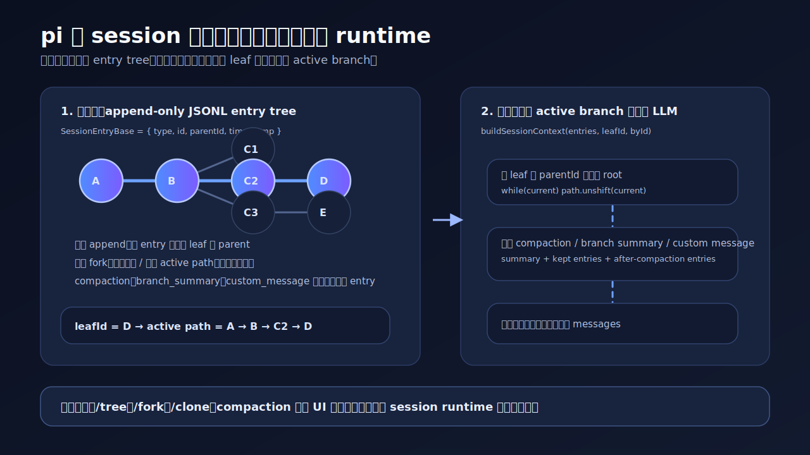

# 02｜为什么 pi 要把 session 做成树，而不是聊天记录



如果你只把 agent 当成聊天机器人，session 很自然就是一条聊天记录：用户一句，助手一句，再接着下一轮。

但做过稍微长一点的 agent 任务就会发现，真实工作很少是一条直线。你可能会遇到这些情况：

- 做到一半发现路线错了，想回到中间某个节点换一种做法；
- 某条分支失败了，但前面的分析仍然有价值；
- 上下文太长，需要压缩，但又不能把历史彻底抹掉；
- 扩展系统需要把自己的状态写进 session，重启后还能恢复；
- 想把当前任务中的一个中间节点拆出去，变成另一个独立任务。

这些都不是“聊天记录管理”能顺手解决的问题。聊天记录默认只有一条时间线；agent 工作需要的是可以分叉、恢复、压缩和迁移的运行时状态。

这就是 `pi` 把 session 做成树的原因。更准确地说：

> `pi` 的 session tree 不是为了让历史记录看起来更酷。它要把一次 agent 工作保存成可分叉、可回放、可压缩、可被扩展系统注入状态的 runtime log。

这也是它和 Claude Code 的差异继续往下落到源码层的一步。

第 01 章说过，`pi` 不是一个“强成品 agent”，更像一个可编程宿主。到了 session 这一层，这个判断变得很具体：它没有把 session 当 transcript，处理方式更接近 runtime state。

---

## 1. 树不是 UI，树是 session 的基本数据模型

先看最底层结构。

在 `packages/coding-agent/src/core/session-manager.ts` 里，所有 session entry 都有同一组基础字段：

```ts
export interface SessionEntryBase {
  type: string;
  id: string;
  parentId: string | null;
  timestamp: string;
}
```

这里真正要看的是 `parentId`。

它不是 UI 层为了展示树形结构临时算出来的，也不是 `/tree` 命令额外维护的一份索引。它就是每个 session entry 的基础字段。

而且 `pi` 里的 entry 不只有 message。它还包括：

- `thinking_level_change`：thinking level 的变化；
- `model_change`：模型变化；
- `compaction`：上下文压缩摘要；
- `branch_summary`：分支摘要；
- `custom`：扩展系统保存自己的状态；
- `custom_message`：扩展系统注入到 LLM 上下文里的内容；
- `label`：用户给某个节点打的标记；
- `session_info`：session 的元信息。

`pi` 记录的不是“用户消息和助手消息列表”，是一棵由多种运行时事件组成的树。

如果只看表层 UI，你可能会觉得这是一个支持分支浏览的聊天工具；但从数据结构看，它保存的是 agent runtime 的演化过程。

---

## 2. 每次 append，都是接到当前 leaf 后面

普通聊天记录的追加逻辑很简单：把新消息 push 到数组末尾就行。

`pi` 的追加逻辑多了一层：新 entry 会接到当前 `leafId` 后面。

还是看 `session-manager.ts` 里的 `appendMessage()`：

```ts
appendMessage(message) {
  const entry = {
    type: "message",
    id: generateId(this.byId),
    parentId: this.leafId,
    timestamp: new Date().toISOString(),
    message,
  };
  this._appendEntry(entry);
  return entry.id;
}
```

`parentId: this.leafId` 这行说明，每一条新消息都不是简单地“排在最后”，而会“挂在当前 leaf 节点下面”。随后 `_appendEntry()` 会把这条 entry 放进 `fileEntries`、更新 `byId` 索引，并把 `leafId` 推进到新 entry。

所以 `pi` 的 session 有两个视角：

- 文件视角：entry 仍然是 append-only 地写进 JSONL；
- 结构视角：每个 entry 通过 `parentId` 组成一棵树。

这有点像 git commit：文件里的对象可以按时间写入，但真正表达历史关系的是 parent。

这个比喻不完全等价，但足够说明 `pi` 为什么不是线性 transcript。

---

## 3. 模型只看到当前 branch，不会吃下整棵树

既然存储层保存的是一棵树，那每次调用模型时，模型到底会看到什么？

答案是：当前 leaf 回溯到 root 的那条路径。

`buildSessionContext()` 的主要逻辑很直接：

```ts
let current = leaf;
while (current) {
  path.unshift(current);
  current = current.parentId ? byId.get(current.parentId) : undefined;
}
```

`pi` 会从当前 leaf 往上沿着 `parentId` 找父节点，直到 root。然后再把这条路径按正序整理成 path。

这样就形成了一个分层：

1. session 文件保存整棵树；
2. 当前 leaf 决定 active branch；
3. `buildSessionContext()` 把 active branch 编译成模型要看的 messages。

所以树不是“每次都把所有历史塞给模型”。正好相反，树让 `pi` 可以保存更多可能性，但每次只选择其中一条运行路径给模型。

这也是它比普通聊天记录更接近 runtime 的地方。

聊天记录只有一个“现在”；session tree 可以保留多个曾经尝试过、但并不处在当前 active path 上的“可能性”。

---

## 4. branch 的动作是移动 leaf

再看分支。

`SessionManager.branch()` 的实现非常短：

```ts
branch(branchFromId: string): void {
  if (!this.byId.has(branchFromId)) {
    throw new Error(`Entry ${branchFromId} not found`);
  }
  this.leafId = branchFromId;
}
```

它没有删除后面的消息，也没有复制一份完整聊天记录，只是把当前 `leafId` 移到指定 entry。

下一次 `appendXXX()` 时，新 entry 就会以这个节点为 parent，形成一条新分支。

源码注释也把这个语义说得很清楚：

> The next appendXXX() call will create a child of that entry, forming a new branch. Existing entries are not modified or deleted.

这句话基本就是 `pi` session tree 的精神：

> 分支不是改写过去，是在旧节点上长出新的未来。

对于 agent 工作来说，这个能力很重要。

很多时候你不是想“撤销历史”，你想保留已有探索，同时从中间某个判断点重新开始。线性聊天记录要么继续往后写，要么复制一大段文本重开。`pi` 则把这个动作变成了 runtime 原语。

---

## 5. fork 可以把一条 active path 提取成新 session

除了在同一个 session 内移动 leaf，`pi` 还支持把某条路径提取成新的 session 文件。

`createBranchedSession(leafId)` 做的第一步是：

```ts
const path = this.getBranch(leafId);
const pathWithoutLabels = path.filter((e) => e.type !== "label");
```

它不是把整棵树复制出去，只拿到 root 到目标 leaf 的那条 branch。

然后它创建新的 session header，把这条 path 写入新的 JSONL 文件：

```ts
this.fileEntries = [header, ...pathWithoutLabels, ...labelEntries];
```

这件事很像“从当前仓库历史中切一条干净分支出来”。旁支仍然留在原 session；新 session 只带走这次运行需要的上下文路径。

这也解释了为什么 `/fork` 不是一个普通 UI 功能。它背后需要 session manager 知道：

- 当前节点是谁；
- 从这个节点回到 root 的路径是什么；
- 哪些 label 需要带过去；
- 新 session 和旧 session 的 parentSession 关系是什么；
- fork 完之后 runtime 要如何切到新 session。

这已经不是 transcript 层能自然表达的东西。

---

## 6. compaction 改变 active branch 的编译方式

长任务一定会遇到上下文过长的问题。很多 agent 的处理方式是：把旧消息总结一下，再把原始历史丢掉。

`pi` 的 compaction 更像是在树上追加一个新的 runtime event。

`CompactionEntry` 包含：

```ts
export interface CompactionEntry<T = unknown> extends SessionEntryBase {
  type: "compaction";
  summary: string;
  firstKeptEntryId: string;
  tokensBefore: number;
  details?: T;
  fromHook?: boolean;
}
```

注意它仍然继承 `SessionEntryBase`，所以也有 `id`、`parentId`、`timestamp`。

`buildSessionContext()` 遇到 compaction 时，会先加入 summary，再从 `firstKeptEntryId` 开始保留一段消息，最后接上 compaction 之后的消息。

大致流程是：

1. 先生成 compaction summary message；
2. 找到 compaction 在 active path 里的位置；
3. 从 `firstKeptEntryId` 开始追加被保留的旧消息；
4. 再追加 compaction 之后的新消息。

compaction 没有把 session history 粗暴改写成一段摘要。它改的是：

> 当前 active branch 被编译给模型时，哪些历史以摘要形式出现，哪些历史仍以原消息形式出现。

这依然是 runtime 视角，而不是聊天记录视角。

---

## 7. extension state 也能挂进 session tree

`pi` 的 session entry 里还有两个很有意思的类型：`custom` 和 `custom_message`。

`custom` 的注释说得很明确：

> Persist extension state across session reloads.

它的用途是让扩展把自己的状态写进 session。重启之后，扩展可以扫描对应的 `customType`，重建内部状态。

但 `custom` 不参与 LLM context。

如果扩展希望向模型上下文注入内容，则使用 `custom_message`。它同样是 session entry，但会在 `buildSessionContext()` 中被转换成 user message。

这两个设计放在一起，`pi` 的宿主味道就出来了：

- 扩展可以保存自己的私有状态；
- 扩展也可以向模型注入内容；
- 两者都挂在 session tree 上；
- session reload 后，扩展能重新理解过去发生过什么。

普通聊天记录很难自然承载这种能力。因为聊天记录关心的是“对话文本”；`pi` 的 session tree 关心的是“运行时事件”。

---

## 8. session 切换会替换 runtime

最后看 `agent-session-runtime.ts`。

`switchSession()`、`newSession()`、`fork()` 都不是简单换一个 session 文件路径。它们大体遵循同一套流程：

1. 触发 `session_before_switch` 或 `session_before_fork`；
2. 如果 hook 取消，则停止；
3. teardown 当前 session；
4. 基于新的 `SessionManager` 创建 runtime；
5. apply 新的 session 和 cwd-bound services；
6. finish replacement，必要时重新绑定 session。

比如 `fork()` 里会先调用 `emitBeforeFork()`，再根据目标位置创建 branched session，随后 teardown 当前 session，并 `createRuntime()` / `apply()` 新 runtime。

session tree 影响的不止历史记录。它还牵动：

- cwd；
- session file；
- extension lifecycle；
- tool services；
- runtime binding；
- session start / shutdown events。

如果说普通聊天应用的 session 是“记录你聊过什么”，那 `pi` 的 session 更像“记录并恢复一个 agent 工作现场”。

---

## 9. 这和 Claude Code 的差异在哪里

这一章不是要说 `pi` 比 Claude Code 更强。

更合适的对比是：

- Claude Code 更像一个设计完整的驾驶舱，它把很多高级工作流做成了产品内建体验；
- `pi` 更像一套可编程底盘，它把工作流的可变部分下沉到 session、runtime、extension 这些宿主能力里。

所以当你看到 `pi` 的 session tree，不要只把它理解成“支持分支聊天”。

它值得看的地方是：`pi` 把 agent 工作中的分叉、回溯、压缩、扩展状态、session 迁移，都放在同一套 runtime log 里表达。

这就是“可编程宿主”落到 session 层后的样子。

---

## 10. 小结

`pi` 为什么不把 session 做成普通聊天记录？

因为它要表达的不是一段聊天，是一段可以继续生长的 agent 工作过程。

线性聊天记录只能回答：

> 之前说过什么？

session tree 能回答更多问题：

> 当前运行在哪条 branch 上？
> 这条 branch 从哪里分出来？
> 哪些历史被压缩成摘要？
> 哪些扩展状态要在重启后恢复？
> 如果从这里 fork，新的 runtime 应该带走哪条路径？

这就是第 02 章要落下来的判断：

> `pi` 的 session tree 不是聊天记录功能，是 agent runtime 的底座能力。

从这一层开始，`pi` 和 Claude Code 的差异就不止是产品形态不同，还包括“工作流能力放在哪里”：

- Claude Code 倾向于把能力收进成品 agent；
- `pi` 倾向于把能力开放在宿主 runtime。

这也解释了为什么 `pi` 对会自己搭 agent 工作台的人更有研究价值：它暴露出来的不是更强聊天界面，是一套可分叉、可恢复、可扩展的 agent 工作现场。
