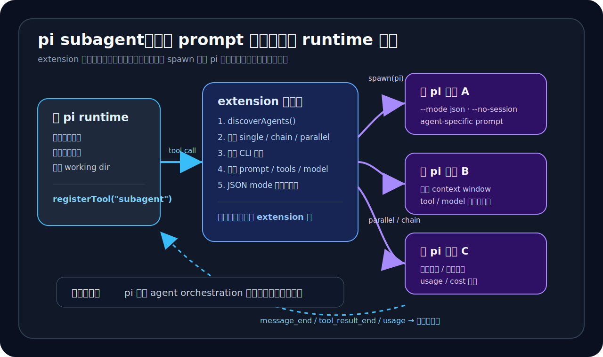

# 03｜pi 的 subagent 不是 prompt 分身，而是独立 runtime 的委派



看到 subagent 这个词，很多人会先想到“多写几个角色 prompt”。

比如一个叫 planner，一个叫 reviewer，一个叫 worker。主 agent 还在同一个上下文里，只是让模型换个口吻、换个职责，临时扮演另一个 agent。

这种做法有用，但不是 `pi` 这个 subagent 示例里最该看的部分。

`pi` 做的更接近另一种做法：

> extension 层启动一个独立的 `pi` 进程，把任务交给另一个 agent runtime，再把结构化结果带回主会话。

这就是第 03 章要拆开的内容。

第 01 章我们说，`pi` 不太像一个打磨到位的成品 agent，更像一个可编程宿主。第 02 章又看到，它的 session 也不是线性聊天记录，而是可以分叉、回放、压缩的 runtime state。

到了 subagent，这个判断又多了一层证据：`pi` 会保存 runtime，也允许高级工作流从 extension 层接进来。

---

## 1. subagent 先看作 extension 注册出来的 tool

先看入口。

`packages/coding-agent/examples/extensions/subagent/index.ts` 里，subagent 是通过 extension API 注册出来的：

```ts
export default function (pi: ExtensionAPI) {
  pi.registerTool({
    name: "subagent",
    label: "Subagent",
    description: [
      "Delegate tasks to specialized subagents with isolated context.",
      "Modes: single (agent + task), parallel (tasks array), chain (sequential with {previous} placeholder).",
      'Default agent scope is "user" (from ~/.pi/agent/agents).',
      'To enable project-local agents in .pi/agents, set agentScope: "both" (or "project").',
    ].join(" "),
    parameters: SubagentParams,
    async execute(...) {
      // ...
    },
  });
}
```

这个入口能说明很多问题。

如果只按功能表看，`pi` 支持 subagent。但从实现位置看，`subagent` 没有写死在 core product 里。它是一个 extension tool。

`pi` 没有把这类高级工作流全部收进官方内核，而是给 extension 留了足够大的接口。工作流可以在外层实现。

这和 Claude Code / cc 的路子不一样。cc 里的 subagent/fork 更像 core runtime 的内部机制：主 agent 内部分叉、共享 prefix、复用 prompt cache、控制 fork child rules。这是一条很强的官方产品路线。

`pi` 这里更像是在说：官方不替你做一个“最优 subagent”，但宿主允许你在 extension 层实现一个 subagent 调度器。

这也接上了前两章反复出现的差异：

> cc 更像强成品 agent；`pi` 更像可编程宿主。

---

## 2. 真正的隔离来自独立 `pi` 进程

这个 extension 到底是怎么委派任务的？

看 `runSingleAgent()`。

它没有把一个新 prompt 塞回主会话，而是组装一组 CLI 参数，然后启动一个新的 `pi` 进程：

```ts
const args: string[] = ["--mode", "json", "-p", "--no-session"];
if (agent.model) args.push("--model", agent.model);
if (agent.tools && agent.tools.length > 0) args.push("--tools", agent.tools.join(","));

if (agent.systemPrompt.trim()) {
  const tmp = await writePromptToTempFile(agent.name, agent.systemPrompt);
  args.push("--append-system-prompt", tmp.filePath);
}

args.push(`Task: ${task}`);

const invocation = getPiInvocation(args);
const proc = spawn(invocation.command, invocation.args, {
  cwd: cwd ?? defaultCwd,
  shell: false,
  stdio: ["ignore", "pipe", "pipe"],
});
```

这里先看三个细节。

第一个，`--no-session`。

它说明子 agent 默认不共享主会话历史，而是一次独立运行。主会话把任务交出去，子 agent 在自己的上下文窗口里完成。

第二个，`--append-system-prompt`。

agent definition 不是展示标签。它会把自己的 system prompt 写入临时文件，再附加到子进程里。

第三个，`--tools` 和 `--model`。

不同 agent 的差异不止是“性格”。它们还可以有不同的工具集合和模型配置。

`pi` 的 subagent 至少有这几层隔离：

- 独立进程；
- 独立上下文；
- agent-specific system prompt；
- agent-specific tools；
- agent-specific model。

到这里，它已经不是 prompt 分身了。

更准确地说：

> 主 runtime 通过 extension 启动另一个 agent runtime。

---

## 3. 父进程消费结构化事件流

如果只是起一个子进程，然后读一段 stdout，那仍然只是 shell out。

`pi` 的实现往前多走了一步：子进程以 JSON mode 运行，父进程逐行解析事件。

源码里有这样一段：

```ts
const processLine = (line: string) => {
  if (!line.trim()) return;
  let event: any;
  try {
    event = JSON.parse(line);
  } catch {
    return;
  }

  if (event.type === "message_end" && event.message) {
    const msg = event.message as Message;
    currentResult.messages.push(msg);
    // accumulate usage, turns, model, stopReason...
    emitUpdate();
  }

  if (event.type === "tool_result_end" && event.message) {
    currentResult.messages.push(event.message as Message);
    emitUpdate();
  }
};
```

这段代码的含义很直接：父进程拿到的是另一个 agent runtime 的结构化事件流，而不是一句最终回复。

主会话可以知道：

- 子 agent 什么时候产出 assistant message；
- 子 agent 什么时候完成 tool result；
- 子 agent 用了多少 input/output token；
- cache read/write 是多少；
- cost 是多少；
- context tokens 是多少；
- stop reason 是什么；
- 用的是哪个 model。

有了结构化事件流，宿主就能重新渲染、折叠、展开、汇总 usage，而不是只能贴一段最终文本。

这也是我把它叫作 runtime 委派的原因。

角色扮演关心的是“模型怎么说”。runtime 委派关心的是“另一个 agent 怎么运行、怎么回传、怎么被宿主接管”。

---

## 4. single / chain / parallel 是最小 orchestration 骨架

`pi` 的 subagent 示例也支持多个 worker。

它定义了三种模式：

```ts
// Single: { agent: "name", task: "..." }
// Parallel: { tasks: [{ agent: "name", task: "..." }, ...] }
// Chain: { chain: [{ agent: "name", task: "... {previous} ..." }, ...] }
```

再看执行逻辑：

- single：调用一次 `runSingleAgent()`；
- chain：按顺序执行，每一步可以把 `{previous}` 替换成上一步输出；
- parallel：用并发限制跑多个任务，`MAX_PARALLEL_TASKS = 8`，`MAX_CONCURRENCY = 4`。

这已经不是只展示概念的 demo。它带着一个多 agent orchestration 的最小骨架：

1. 有 agent discovery；
2. 有任务分发；
3. 有串行依赖；
4. 有并行执行；
5. 有 streaming update；
6. 有 usage 汇总；
7. 有错误中断。

这不等于 `pi` 已经是成熟的多 agent 平台。更合适的表述是：

> `pi` 展示了一个高级工作流怎样从 extension 层接入宿主。

这比“它支持 subagent”这个功能点能说明更多东西。

如果宿主 surface 足够稳定，今天可以接 subagent，明天也可以接 plan mode、review workflow、research workflow、CI assistant、文档 agent、repo-local worker。

`pi` 这条路线吸引人的地方，不在某个内建功能有多完整，而在这些工作流不必都进 core 才能运行。

---

## 5. project agents 暴露了宿主路线的信任边界

还有一个容易被忽略的问题：agent 从哪里来。

`agents.ts` 支持两类 agent definition：

```ts
export type AgentScope = "user" | "project" | "both";
```

发现逻辑大概是：

- user agents 来自 `~/.pi/agent/agents/*.md`；
- project agents 来自 `.pi/agents/*.md`；
- 默认只加载 user-level agents；
- 如果 scope 是 `project` 或 `both`，才会加载项目内 agents。

入口处还特别写了说明：

```ts
'Default agent scope is "user" (from ~/.pi/agent/agents).',
'To enable project-local agents in .pi/agents, set agentScope: "both" (or "project").',
```

并且在交互环境里，如果真的要运行 project-local agents，还会提示确认：

```ts
const ok = await ctx.ui.confirm(
  "Run project-local agents?",
  `Agents: ${names}\nSource: ${dir}\n\nProject agents are repo-controlled. Only continue for trusted repositories.`,
);
```

这不是普通的小细节。

只要一个 repo 能放 `.pi/agents/*.md`，它就能提供 repo-local prompt。这个 prompt 可能让 agent 读文件、跑命令、修改代码。project agent 因此天然落在信任边界上。

`pi` 默认不加载 project agents，要求显式 scope，并在交互模式下提醒确认。这说明作者知道宿主路线会带来额外成本。

越可编程，越需要治理边界。

这也给后面的收口章留了一个点：`pi` 的 host/runtime 路线更自由，但不是免费午餐。extension、project agents、custom tools、custom providers 都会把产品从“固定功能集合”推向“需要治理的运行平台”。

能力边界扩大，安全边界也要跟着扩大。

---

## 6. 和 cc fork path 的差异

现在可以把差异收一下了。

cc 的 fork/subagent 路线，更像产品内部的一条优化型分叉机制。

它关心的是：

- 如何从主 agent 高性能分出 worker；
- 如何保留 parent assistant message；
- 如何构造 byte-identical prefix；
- 如何最大化 prompt cache sharing；
- 如何通过 synthetic rules 管住 fork child。

这是一条很强的内建产品路线。

`pi` 的 subagent 路线不一样。

它关心的是：

- extension 如何注册一个 subagent tool；
- 如何发现 user / project agents；
- 如何为每个 agent 注入 prompt / tools / model；
- 如何 spawn 独立 `pi` runtime；
- 如何用 JSON event stream 把结果带回主会话；
- 如何支持 single / chain / parallel；
- 如何处理 project-local agent 的信任边界。

两边的差异不在于“谁有没有 subagent”，而在于实现路径不同。

用一句话概括：

> cc 的 fork 是产品内部的优化型分叉机制；`pi` 的 subagent 是宿主之上的可编排 runtime 委派。

前者更像强成品 agent 的内部能力，后者更像可编程宿主暴露出来的扩展面。

---

## 结语：subagent 证明高级工作流可以从宿主层长出来

第 02 章讲 session tree 时，我们看到 `pi` 没有把工作历史当成一条聊天记录，而是保存成 runtime state。

第 03 章看 subagent，又能看到另一层：`pi` 没有把所有高级工作流都写死在 core product 里。

它让 extension 注册 tool，让 extension 发现 agents，让 extension spawn 新 `pi`，让 extension 消费 JSON event stream，再把结果渲染回主会话。

这正是 `pi` 适合拿来研究的地方。

它不是在说：官方已经给你做好了一个最强 subagent。

它更像是在展示：

> 只要宿主 runtime 足够开放，多 agent orchestration 就可以作为外部能力接进来。

这也是为什么 `pi` 不能只按功能表去读。

功能表会告诉你：它有 subagent。

源码会告诉你更具体的事：它把 subagent 放在 extension 层实现。它想做的不是不断往 core 里堆功能，而是让 agent 工作流有地方继续生长。
