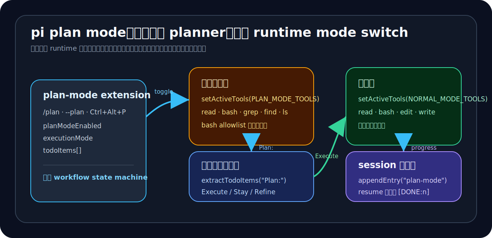

# 04｜plan mode 不是内建 planner，而是宿主切出来的一种工作模式



看到 plan mode，最容易产生的误解是：`pi` 也内建了一个 planner agent。

也就是说，用户发起计划模式后，系统把任务交给某个官方 planner 角色，让它先分析，再交回 worker 执行。

但 `pi` 的实现不是这个方向。

`pi` 的 plan mode 更像是：

> 同一个主 runtime 在“只读探索态”和“执行态”之间切换；切换的不只是 prompt，还有工具池、bash 约束、上下文注入、todo 状态和 session 持久化。

这章要讲的不是 `/plan` 怎么用，而是它在产品路线上的含义。

第 03 章讲 subagent 时，我们看到 `pi` 可以通过 extension 启动独立子 runtime，把任务委派出去。plan mode 则展示了另一条路：不启动子 runtime，而是把当前 runtime 切成另一种工作模式。

这两条路合起来，正好说明 `pi` 的宿主化不是口号。

它已经展示了至少两种高级工作流外化方式：

- subagent：委派型，起独立 runtime；
- plan mode：模态切换型，改变主 runtime 的行为。

---

## 1. plan mode 的第一步不是换角色，而是切工具池

先看最直接的源码。

`packages/coding-agent/examples/extensions/plan-mode/index.ts` 里有两组工具池：

```ts
const PLAN_MODE_TOOLS = ["read", "bash", "grep", "find", "ls", "questionnaire"];
const NORMAL_MODE_TOOLS = ["read", "bash", "edit", "write"];
```

进入 plan mode 时，extension 会切换 active tools：

```ts
if (planModeEnabled) {
  pi.setActiveTools(PLAN_MODE_TOOLS);
  ctx.ui.notify(`Plan mode enabled. Tools: ${PLAN_MODE_TOOLS.join(", ")}`);
} else {
  pi.setActiveTools(NORMAL_MODE_TOOLS);
  ctx.ui.notify("Plan mode disabled. Full access restored.");
}
```

这里的重点很清楚：plan mode 的第一本质不是“换一个 planner 人设”，而是“改变当前 runtime 的可用能力”。

只读探索态下，`edit` 和 `write` 被拿掉。模型可以读文件、搜索、列目录、问问题，也可以调用 bash，但不能直接修改代码。

这和内建 planner agent 的路线不一样。

如果是内建 planner，系统会更强调“由哪个 agent 负责计划”。而 `pi` 这里更强调“当前 runtime 处于什么模式”。

所以本章的核心判断可以先落下来：

> `pi` 的 plan mode 不是一个官方 planner 角色，而是宿主 runtime 的 mode switch。

---

## 2. 只读不是靠模型自觉，而是靠 runtime enforcement

只把 `edit` / `write` 拿掉还不够。

因为 bash 仍然可能修改文件。比如 `rm`、`mv`、`git reset`、`npm install`、`chmod`、重定向写文件，都可能破坏“只读探索”的边界。

所以 plan mode 又在 `tool_call` hook 上拦截 bash：

```ts
pi.on("tool_call", async (event) => {
  if (!planModeEnabled || event.toolName !== "bash") return;

  const command = event.input.command as string;
  if (!isSafeCommand(command)) {
    return {
      block: true,
      reason: `Plan mode: command blocked (not allowlisted). Use /plan to disable plan mode first.\nCommand: ${command}`,
    };
  }
});
```

这段很重要。

它说明 plan mode 不是只在 prompt 里写一句“请不要修改文件”。它真的把 bash 调用放进 runtime 检查里。

再看 `utils.ts`，`isSafeCommand()` 的逻辑也很直白：

```ts
export function isSafeCommand(command: string): boolean {
  const isDestructive = DESTRUCTIVE_PATTERNS.some((p) => p.test(command));
  const isSafe = SAFE_PATTERNS.some((p) => p.test(command));
  return !isDestructive && isSafe;
}
```

它一边列 destructive patterns，比如：

- `rm`、`mv`、`cp`、`mkdir`、`touch`；
- `chmod`、`chown`、`truncate`、`dd`；
- 输出重定向；
- `npm install`、`pip install`、`brew install`；
- `git add`、`git commit`、`git push`、`git reset`；
- `sudo`、`kill`、`reboot`；
- `vim`、`nano`、`code`。

另一边列 safe patterns，比如：

- `cat`、`head`、`tail`、`grep`、`find`、`ls`；
- `pwd`、`wc`、`diff`、`file`、`stat`；
- `git status`、`git log`、`git diff`、`git show`；
- `npm list`、`npm view`、`npm audit`；
- `rg`、`fd`、`jq`、`sed -n`。

这就把 plan mode 的边界从“模型应该怎么做”，推进到了“宿主允许它怎么做”。

这点非常关键。

因为 agent 系统里，prompt 约束经常是不稳定的。模型可能忘记，也可能为了完成任务绕过去。runtime enforcement 则不同：不在允许范围内的 bash 命令会直接被 block。

所以 `pi` 的 plan mode 不是单纯的 prompt 技巧，而是宿主层的能力约束。

---

## 3. before_agent_start 注入的是状态化 context

工具池和 bash allowlist 解决的是“能做什么”。

但模型还需要知道当前处于什么模式、应该输出什么格式。这个由 `before_agent_start` hook 完成。

在只读探索态下，extension 会注入一段隐藏上下文：

```ts
[PLAN MODE ACTIVE]
You are in plan mode - a read-only exploration mode for safe code analysis.

Restrictions:
- You can only use: read, bash, grep, find, ls, questionnaire
- You CANNOT use: edit, write (file modifications are disabled)
- Bash is restricted to an allowlist of read-only commands

Create a detailed numbered plan under a "Plan:" header:

Plan:
1. First step description
2. Second step description
...

Do NOT attempt to make changes - just describe what you would do.
```

切到执行态后，注入的上下文又变了：

```ts
[EXECUTING PLAN - Full tool access enabled]

Remaining steps:
${todoList}

Execute each step in order.
After completing a step, include a [DONE:n] tag in your response.
```

这说明 plan mode 里的 prompt 不是一次性写死的 system prompt，而是随着宿主状态变化而变化的 runtime context layer。

只读态告诉模型：不要改，输出 `Plan:`。

执行态告诉模型：现在有完整工具访问，按 remaining steps 执行，并用 `[DONE:n]` 标记进度。

这和“planner agent”很不一样。

planner agent 是一个角色；plan mode 是一组宿主状态。

角色回答“你是谁”；状态回答“当前 runtime 允许你做什么、应该怎么推进、进度保存在哪里”。

---

## 4. 它不是计划生成器，而是计划状态机

如果 plan mode 只是让模型输出一个计划，那它很普通。

`pi` 这里真正有意思的是：它把计划变成了一个小型状态机。

源码里至少有三个状态变量：

```ts
let planModeEnabled = false;
let executionMode = false;
let todoItems: TodoItem[] = [];
```

围绕这三个变量，状态推进链大概是这样：

1. 用户通过 `/plan`、`--plan` 或 `Ctrl+Alt+P` 进入 plan mode；
2. extension 把工具池切到 `PLAN_MODE_TOOLS`；
3. 模型在 `[PLAN MODE ACTIVE]` 约束下输出 `Plan:`；
4. `agent_end` 时，extension 从最后一条 assistant message 里抽取 numbered todos；
5. UI 展示计划步骤；
6. 用户选择：Execute the plan / Stay in plan mode / Refine the plan；
7. 如果选择 Execute，plan mode 关闭，execution mode 打开；
8. 工具池恢复 `NORMAL_MODE_TOOLS`；
9. extension 自动发送一条 `plan-mode-execute` 消息触发执行；
10. 执行过程中，模型用 `[DONE:n]` 标记已完成步骤；
11. `turn_end` 解析 `[DONE:n]` 并更新 todo 状态；
12. 全部完成后，发送 `Plan Complete!`，清空 execution state。

这已经不是“出个计划”的小功能，而是一个完整的 workflow loop。

它有入口、有受限态、有计划抽取、有用户确认、有执行态、有进度追踪、有完成条件。

所以更准确的说法是：

> `pi` 的 plan mode 是 extension 层实现的轻量 workflow state machine。

这句话对理解 `pi` 很重要。

因为它说明高级工作流不一定非要进入 core。只要宿主给了足够多的 hook 和 session 能力，extension 就能自己管理一段工作流生命周期。

---

## 5. `[DONE:n]` 是简单但有效的进度协议

`[DONE:n]` 看起来很朴素，但它在这套机制里承担了一个关键作用：让自然语言执行过程和结构化 todo state 对齐。

`utils.ts` 里负责解析：

```ts
export function extractDoneSteps(message: string): number[] {
  const steps: number[] = [];
  for (const match of message.matchAll(/\[DONE:(\d+)\]/gi)) {
    const step = Number(match[1]);
    if (Number.isFinite(step)) steps.push(step);
  }
  return steps;
}

export function markCompletedSteps(text: string, items: TodoItem[]): number {
  const doneSteps = extractDoneSteps(text);
  for (const step of doneSteps) {
    const item = items.find((t) => t.step === step);
    if (item) item.completed = true;
  }
  return doneSteps.length;
}
```

它没有复杂协议，也没有额外数据库。模型只要在回复里包含 `[DONE:1]`、`[DONE:2]`，extension 就能把对应 todo 标记完成。

这当然不是最严密的工作流系统，但它很符合 `pi` 当前的定位：用最小机制验证宿主能力。

更重要的是，`[DONE:n]` 不只是给用户看的文本。它会被 extension 重新解释为状态更新。

也就是说，assistant message 同时承担两层含义：

- 对用户：说明完成了什么；
- 对 extension：携带可解析的 workflow progress signal。

这也是 host/runtime 路线里经常出现的模式：自然语言和结构化状态之间有一层轻量协议。

---

## 6. 计划状态被写回 session，而不是只放在内存里

如果 plan mode 的状态只存在内存里，重启 session 就全丢了。

`pi` 没这么做。

它有一个 `persistState()`：

```ts
function persistState(): void {
  pi.appendEntry("plan-mode", {
    enabled: planModeEnabled,
    todos: todoItems,
    executing: executionMode,
  });
}
```

也就是说，plan mode 会把自己的状态写成 custom entry，追加到 session 里。

再看 `session_start`：

```ts
const planModeEntry = entries
  .filter((e) => e.type === "custom" && e.customType === "plan-mode")
  .pop();

if (planModeEntry?.data) {
  planModeEnabled = planModeEntry.data.enabled ?? planModeEnabled;
  todoItems = planModeEntry.data.todos ?? todoItems;
  executionMode = planModeEntry.data.executing ?? executionMode;
}
```

这说明 plan mode 不是一次性脚本，而是接入了 session runtime。

更细的是 resume 逻辑。

如果恢复时发现仍在 execution mode，它会找到最后一个 `plan-mode-execute`，只扫描它之后的 assistant messages，再用 `[DONE:n]` 重新计算 completion：

```ts
// Only scan messages AFTER the last "plan-mode-execute"
const allText = messages.map(getTextContent).join("\n");
markCompletedSteps(allText, todoItems);
```

这点和第 02 章 session tree 能接上。

第 02 章我们说：`pi` 的 session 不是聊天记录，而是 runtime log。

plan mode 正好给了一个具体例子：extension 可以把自己的 workflow state 写进 session；恢复时再从 session 里重建当前状态。

所以 session 里保存的不只是用户说了什么、模型答了什么，还保存了 extension 认为“当前工作流进行到哪里”。

这就是宿主路线。

---

## 7. 和 subagent 合起来看：两种外化路线

现在可以把第 03 章和第 04 章放在一起看。

subagent 代表的是委派型外化：

- 主 runtime 仍然存在；
- extension 发现 agent；
- extension spawn 独立 `pi` 进程；
- 子 runtime 独立执行；
- 结果通过 JSON event stream 回传。

plan mode 代表的是模态切换型外化：

- 不起子进程；
- 仍然是同一个主 runtime；
- extension 切换工具池；
- extension 注入不同上下文；
- extension 管理 todo 状态；
- session 保存 workflow state。

这两者的共同点是：它们都不是单纯 prompt 技巧。

不同点是：

- subagent 改变的是“任务由谁来跑”；
- plan mode 改变的是“当前 runtime 以什么模式跑”。

这对理解 `pi` 很关键。

如果 `pi` 只展示 subagent，我们可能会说：它支持外部委派。

但加上 plan mode 后，判断更稳了：

> `pi` 的 extension surface 不只适合长出新 agent，也适合改造主 agent 自己的运行方式。

这就是可编程宿主的味道。

---

## 结语：plan 是 host behavior，不是官方角色

回到开头的问题：`pi` 的 plan mode 到底是什么？

它不是一个内建 planner agent。

它更像是一段 host behavior：

- 进入只读探索态；
- 限制工具池；
- 约束 bash；
- 注入 plan context；
- 抽取 numbered todos；
- 让用户确认执行；
- 切到执行态；
- 用 `[DONE:n]` 追踪进度；
- 把状态写回 session；
- resume 时重建执行状态。

这一整套行为是 extension 驱动的。

所以它再次证明了全书的主线：

> `pi` 的高级工作流不是只能作为官方内建功能出现，也可以作为宿主 runtime 上的一种可编程行为长出来。

这也是 `pi` 和强成品 agent 路线的核心区别。

强成品 agent 会倾向于把 planner、worker、reviewer 这些能力做成官方角色和官方流程。

`pi` 更像是把 runtime surface 打开，让这些流程在 extension 层自己生长。

plan mode 就是一个很小但很清楚的证据：

> plan 不是另一个人来做，而是同一个 runtime 换了一种工作方式。
