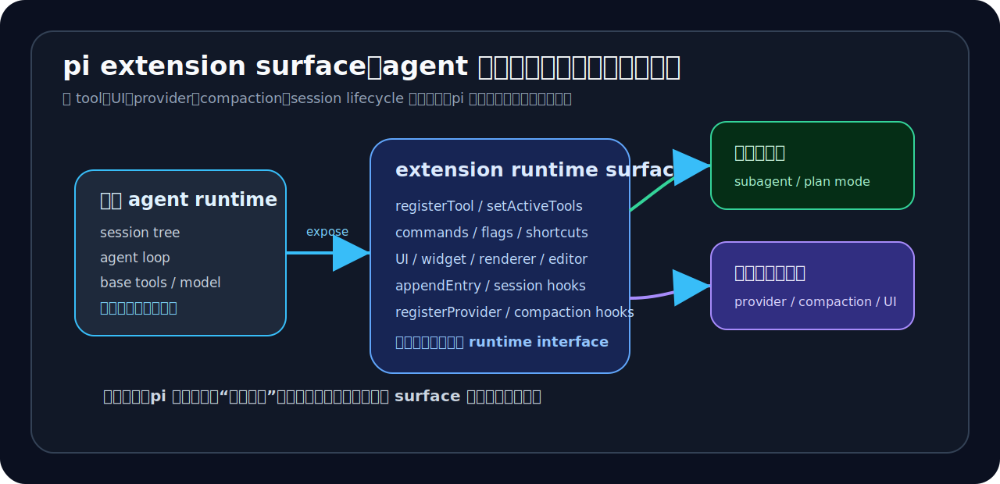

# 05｜当 tool、UI、provider、compaction 都能外化，agent 产品会变成什么



前面两章看了两个很具体的例子。

第 03 章里，subagent 没有在主上下文里做一个 prompt 分身。它是 extension 层启动独立的 `pi` runtime，再把任务交出去。

第 04 章里，plan mode 也不是内置的 planner agent。它用的是同一个主 runtime，只是在只读探索态和执行态之间切换。

一个讲委派，一个讲切模式。看起来不是一回事。

但放到 extension 这一层看，它们其实都在说明同一个设计取向：

> `pi` 把一部分高级工作流从 core product 里拿出来，放到 extension runtime surface 上。

所以这一章把问题再往上提一层：如果 tool、UI、provider、compaction、session lifecycle 都可以外化，agent 产品会变成什么？

我的判断是：

> 它会从“固定功能集合”，变成一个更接近“可编程宿主平台”的东西。

这也是 `pi` 和强成品 agent 路线很不一样的地方。

---

## 1. extension 不是插件点，而是 runtime interface

很多产品说自己支持插件，实际可能只是允许用户多加几个 tool。

`pi` 的 extension surface 要大得多。

看 `packages/coding-agent/src/core/extensions/types.ts`，extension 能碰到的层很多。

它可以注册 LLM 可调用工具：

```ts
registerTool(...)
```

可以注册命令、快捷键和 CLI flag：

```ts
registerCommand(...)
registerShortcut(...)
registerFlag(...)
```

可以改 UI：

```ts
ctx.ui.setStatus(...)
ctx.ui.setWidget(...)
ctx.ui.setFooter(...)
ctx.ui.setHeader(...)
ctx.ui.setEditorComponent(...)
registerMessageRenderer(...)
```

可以写 session state：

```ts
appendEntry(customType, data)
setSessionName(name)
setLabel(entryId, label)
```

可以改工具面：

```ts
getActiveTools()
getAllTools()
setActiveTools(toolNames)
refreshTools()
```

也可以处理模型和 provider：

```ts
setModel(model)
registerProvider(name, config)
unregisterProvider(name)
```

再加上一组 lifecycle hooks，比如：

- `session_start`
- `session_before_compact`
- `session_compact`
- `session_before_tree`
- `before_agent_start`
- `before_provider_request`
- `after_provider_response`
- `tool_call`
- `tool_result`
- `turn_end`

这就不只是“给 agent 加几个小功能”的插件系统了。它更像一组 runtime interface。

extension 可以参与这些事情：

- agent 能用什么工具；
- 用户看到什么 UI；
- 模型请求怎么发；
- session 状态怎么保存；
- compaction 怎么做；
- agent 每轮开始前看到什么上下文；
- provider 请求前后怎么被改写、怎么被观察。

到这里，`pi` 的产品取向就比较清楚了。

它不是在说“我内置了更多功能”。它说的是：

> agent 的很多层，都可以变成可编程 surface。

---

## 2. provider 外化：基础设施也可以由 extension 接管

最能说明“这不是普通插件”的，是 provider。

普通插件系统通常只能加 tool，很少允许扩展模型 provider。原因也不难理解。provider 牵涉到很多基础设施细节：

- base URL；
- API key；
- OAuth；
- model list；
- streaming protocol；
- cost / context window / max tokens；
- provider-specific request / response 结构。

但 `pi` 的 `registerProvider()` 明确把这些交给了 extension。

`types.ts` 里的注释写得很直接：

```ts
/**
 * Register or override a model provider.
 *
 * If `models` is provided: replaces all existing models for this provider.
 * If only `baseUrl` is provided: overrides the URL for existing models.
 * If `oauth` is provided: registers OAuth provider for /login support.
 * If `streamSimple` is provided: registers a custom API stream handler.
 */
registerProvider(name: string, config: ProviderConfig): void;
```

`custom-provider-anthropic` 示例更具体。

它直接注册一个 `custom-anthropic` provider：

```ts
export default function (pi: ExtensionAPI) {
  pi.registerProvider("custom-anthropic", {
    baseUrl: "https://api.anthropic.com",
    apiKey: "CUSTOM_ANTHROPIC_API_KEY",
    api: "custom-anthropic-api",

    models: [
      {
        id: "claude-opus-4-5",
        name: "Claude Opus 4.5 (Custom)",
        reasoning: true,
        input: ["text", "image"],
        cost: { input: 5, output: 25, cacheRead: 0.5, cacheWrite: 6.25 },
        contextWindow: 200000,
        maxTokens: 64000,
      },
      // ...
    ],

    oauth: {
      name: "Custom Anthropic (Claude Pro/Max)",
      login: loginAnthropic,
      refreshToken: refreshAnthropicToken,
      getApiKey: (cred) => cred.access,
    },

    streamSimple: streamCustomAnthropic,
  });
}
```

这说明 provider 不只是一个配置项。它已经是 extension 可以接管的一层基础设施。

这对系统型用户很有用。真实环境里的模型访问，常常不是“填一个官方 API key”就结束。你可能需要：

- 接公司内部模型网关；
- 接自建 proxy；
- 改 OAuth 登录；
- 按团队成本模型重写 price metadata；
- 支持一个还没进入官方 provider list 的 API；
- 对请求和响应做定制处理。

强成品 agent 通常把 provider support 当成产品能力：官方支持哪个，你就用哪个。

`pi` 的做法更像是：provider 也可以长在宿主层。

这就是“宿主平台”和“功能产品”的差别。

---

## 3. compaction 外化：上下文治理也不是封闭 core 行为

另一个值得看的点是 compaction。

上下文压缩通常会被看成 agent core 的内部能力。因为它关系到：

- 哪些历史要保留；
- 哪些历史要总结；
- summary 怎么写；
- 从哪个 entry 开始保留；
- 压缩后模型看到什么。

如果这个能力完全封在 core 里，extension 顶多只能触发一下。

但 `pi` 暴露了 `session_before_compact`。

`types.ts` 里定义：

```ts
export interface SessionBeforeCompactEvent {
  type: "session_before_compact";
  preparation: CompactionPreparation;
  branchEntries: SessionEntry[];
  customInstructions?: string;
  signal: AbortSignal;
}
```

对应的 result 允许 extension：

```ts
export interface SessionBeforeCompactResult {
  cancel?: boolean;
  compaction?: CompactionResult;
}
```

也就是说，extension 收到的不是一个只读通知。它可以取消，也可以直接返回自定义 compaction 结果。

`AgentSession.compact()` 里的流程也能对上这一点：

```ts
if (this._extensionRunner.hasHandlers("session_before_compact")) {
  const result = await this._extensionRunner.emit({
    type: "session_before_compact",
    preparation,
    branchEntries: pathEntries,
    customInstructions,
    signal: this._compactionAbortController.signal,
  });

  if (result?.cancel) {
    throw new Error("Compaction cancelled");
  }

  if (result?.compaction) {
    extensionCompaction = result.compaction;
    fromExtension = true;
  }
}
```

如果 extension 给了 compaction，就用 extension 的结果；否则才走默认 compact。

最后它还会把 compaction 写回 session，并发出 `session_compact` 事件：

```ts
this.sessionManager.appendCompaction(
  summary,
  firstKeptEntryId,
  tokensBefore,
  details,
  fromExtension,
);

await this._extensionRunner.emit({
  type: "session_compact",
  compactionEntry: savedCompactionEntry,
  fromExtension,
});
```

所以 compaction 在这里也成了 host behavior。

这比“支持自定义摘要 prompt”更往里走了一步。

extension 可以参与上下文治理，而上下文治理会直接影响长期 agent 工作的质量。

如果说 session tree 是 runtime state 的存储底座，那么 compaction hook 就是
extension 改写 runtime state 的入口之一。

---

## 4. session custom entry 是 workflow state 的落点

前面几章反复提到一个东西：custom entry。

在 extension API 里，它叫：

```ts
appendEntry<T = unknown>(customType: string, data?: T): void;
```

落到 `AgentSession` 里，是：

```ts
appendEntry: (customType, data) => {
  this.sessionManager.appendCustomEntry(customType, data);
}
```

这个接口看起来很小，但在宿主路线里很有分量。

一旦 extension 可以把自己的状态写进 session，它就不再只是一个内存里的临时脚本。

它可以把 workflow state 变成 session tree 的一部分。

第 04 章的 plan mode 已经展示了这一点：

- plan mode 把 `enabled`、`todos`、`executing` 写进 custom entry；
- session resume 时再从 entries 里恢复；
- 执行态还会扫描 `[DONE:n]`，重建 todo completion。

这意味着 session 里保存的不是单纯的“聊天记录”。

它保存的是：

- 用户和模型的消息；
- 工具调用结果；
- compaction；
- branch summary；
- labels；
- extension 自己的 workflow state。

这也是第 02 章 session tree 往后继续展开的含义。

当 session 能保存 extension state，agent 产品就不只是一个对话窗口。它更像一个可以恢复、分叉、压缩、扩展的工作台。

---

## 5. 从功能集合到宿主平台

现在可以把这条线收一下。

如果一个 agent 产品的能力主要来自 core product，它的竞争方式就很像功能表竞争：

- 谁内置的 worker 更多；
- 谁内置的 plan 更好；
- 谁内置的 provider 更多；
- 谁内置的 UI 更完整；
- 谁内置的上下文策略更聪明。

这是一条强成品路线。

Claude Code / cc 很大程度上就是这样：官方把很多重要工作流做进产品内部，用户直接用。

`pi` 不是完全相反。它也有 core，也有默认工具，也有默认 session 和默认 provider。

但它更值得研究的地方在于：

> 很多原本会被封进 core 的东西，被改成了 extension 可以参与的 runtime surface。

于是 agent 产品的形态开始变化。

它不只是“一个功能集合”，而更像“一个宿主平台”：

- tool 可以外化；
- UI 可以外化；
- command / shortcut / flag 可以外化；
- provider 可以外化；
- compaction 可以外化；
- session state 可以外化；
- 高级工作流可以外化。

这也是我一直强调的：`pi` 的卖点不是“比 cc 多了什么功能”。

更准确地说：

> `pi` 允许系统型用户把自己的 agent 工作流接到宿主里。

---

## 6. 这条路线对谁值钱

这条路线不一定适合所有人。

如果一个用户只想要开箱即用，希望官方替自己决定好大部分流程，那强成品 agent 可能更舒服。

但对另一类用户，`pi` 的价值会更明显。

比如：

- 你想把公司内部模型网关接进来；
- 你想让 agent 使用团队自己的审批和权限策略；
- 你想做 repo-local 的工作流；
- 你想自定义 compaction，让摘要符合团队上下文；
- 你想把 plan、review、test、commit 做成自己的流程；
- 你想控制 UI，而不是接受官方固定展示；
- 你想在 session tree 上保存自己的状态。

这类用户关心的不是“官方菜单里有没有这个功能”。

他们会更在意：

> 我能不能把自己的系统接进去？我能不能把自己的 workflow 长出来？

对这类人，`pi` 的 host/runtime 路线有吸引力。

---

## 7. 代价：越像宿主，越需要治理

但这条路线不是免费午餐。

越开放，治理复杂度越高。

如果 extension 可以注册 tool，就要考虑 tool 权限。

如果 extension 可以改 UI，就要考虑 UI 行为和用户信任。

如果 extension 可以注册 provider，就要考虑凭据、OAuth、请求改写、数据出境。

如果 extension 可以改 compaction，就要考虑摘要质量、上下文丢失、审计难度。

如果 extension 可以写 custom entry，就要考虑 session schema、恢复逻辑、分叉语义。

如果 project-local agent 或 project-local extension 被加载，就要考虑
repo-controlled prompt / code 是否可信。

第 03 章 subagent 已经碰到这个问题：project agents 默认不加载，启用 project/both 时还要确认。

第 04 章 plan mode 也碰到这个问题：只读不是靠 prompt，而是要用 runtime enforcement 做 bash allowlist。

所以 `pi` 的宿主路线有一个天然代价：

> 它把更多能力交给用户和 extension，也把更多治理责任放到了宿主边界上。

这不是缺点，也不是优点。它就是这条产品路线的价格。

强成品 agent 把更多决定收在官方 core 里，用户少操心，但可塑性低。

可编程宿主把更多 surface 放出来，用户能搭出自己的系统，但需要更强的工程能力和治理意识。

---

## 结语：pi 的价值不是功能最多，而是可继续生长

回到本章开头的问题：当 tool、UI、provider、compaction 都能外化，agent 产品会变成什么？

答案是：它会更像一个宿主平台。

`pi` 的价值，不在于它现在内置了多少功能，而在于它把 agent 的很多层拆成了可以继续编程的 surface。

这样看，前几章也能串起来：

- session tree：让工作过程变成 runtime state；
- subagent：让任务委派长在 extension 层；
- plan mode：让主 runtime 切出新的工作模式；
- provider：让模型基础设施也能被 extension 接管；
- compaction：让上下文治理也能被 extension 介入；
- custom entry：让 extension state 能写回 session。

所以 `pi` 不是“另一个 Claude Code”。

它更像另一种 agent 产品路线：

> 少一点官方强成品，多一点宿主 surface；少一点固定流程，多一点可生长工作台。

这条路线不会让所有人都更轻松。

但对会自己搭 agent 工作台的人，它很值得研究。
