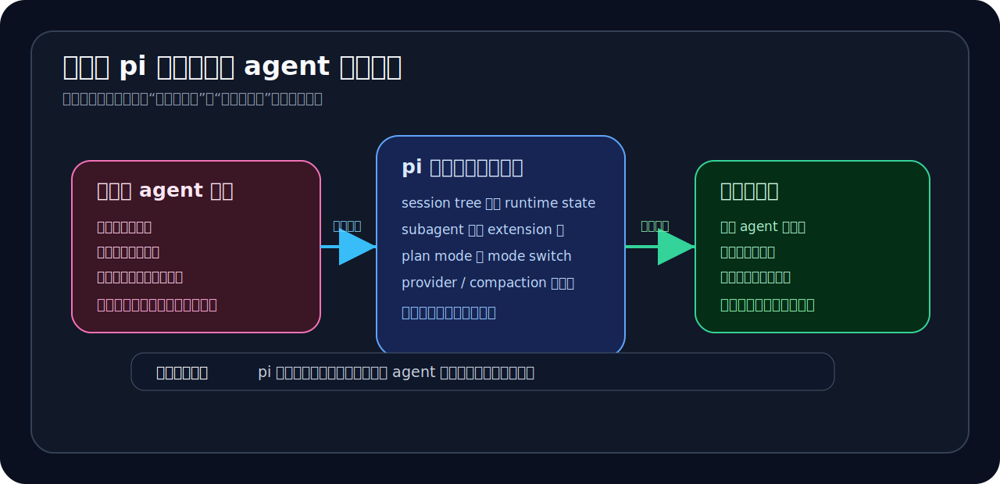

# 06｜为什么 pi 代表另一种 agent 产品路线

如果只把 `pi` 当成“又一个 coding agent”，前面几章会显得有点绕。

为什么要花这么多篇幅讲 session tree？

为什么要盯着 subagent 是不是独立 runtime？

为什么 plan mode 不写成使用教程，而要反复说它是 mode switch？

为什么最后还要把 provider、compaction、UI 这些 surface 放在一起看？

原因很简单：

> `pi` 最值得看的，不是它现在有哪些功能，而是它把 agent 产品做成了另一种形态。

它不是在和 Claude Code 做同一张功能表上的逐项竞争。

它更像是在回答另一个问题：

> 如果不把所有高级工作流都做进官方 core，而是把 agent 做成一个可编程宿主，会得到什么？又会失去什么？

这就是结语要收住的判断。

---

## 1. 前面五章其实只证明了一句话

这本小书不是 `pi` 的完整说明书。

它没有逐条讲命令，没有做 provider 大全，也没有把 monorepo 每个 package 都拆一遍。

前面五章其实只服务一句话：

> `pi` 的卖点，不是它比 Claude Code 多了什么功能，而是它把 agent 做成了可编程宿主。

回头看，论证链并不复杂。

第 01 章先定产品定位：

> Claude Code 更像已经做得很强的官方 agent 成品，而 `pi` 更像让你自己长出 agent 工作流的宿主。

第 02 章把这个判断落到 session 层：

> `pi` 的 session tree 不是聊天记录，而是 runtime state。

它用 `id + parentId` 保存工作过程，让分叉、恢复、压缩、custom entry 都有了底座。

第 03 章看 subagent：

> subagent 不是 prompt 分身，而是 extension 层启动独立 `pi` runtime 的委派机制。

它说明高级工作流可以不写进 core，而是长在 extension 层。

第 04 章看 plan mode：

> plan mode 不是内置 planner，而是主 runtime 在只读探索态和执行态之间切换。

它说明高级工作流不只有“委派”这一种外化方式，也可以是主 runtime 的 mode switch。

第 05 章把 surface 收起来：

> 当 tool、UI、provider、compaction、session lifecycle 都能外化，agent 产品就不只是固定功能集合，而更像宿主平台。

所以这本书真正想说的，不是“`pi` 某个功能很酷”。

而是：

> `pi` 在尝试把 agent 从强成品产品，反过来做成可继续生长的宿主。

---

## 2. 它不是为了所有人

这个判断要讲清楚，否则很容易把 `pi` 写成宣传稿。

`pi` 这条路线不一定适合所有人。

如果你想要的是：

- 打开就能用；
- 官方替你定义 planner、reviewer、subagent；
- 官方替你处理 provider、权限、UI、上下文压缩；
- 尽量少理解 runtime 和 extension；
- 尽量少承担工程治理成本；

那强成品 agent 可能更合适。

这也是 Claude Code / cc 这类路线的优势。

它们把很多重要工作流做进官方 core，用户不需要自己搭太多东西。你接受官方设计，换来的是成熟、稳定、少折腾。

`pi` 不是这个方向。

它的 core 更克制。很多高级能力没有默认塞进产品主干，而是通过 extension、package、runtime surface 留给用户去长。

这意味着你得到更高可塑性，也要承担更多复杂度。

所以不能简单说 `pi` 更好。

更准确地说：

> `pi` 不是更省心的路线，而是更可塑的路线。

---

## 3. 它对系统型用户特别值钱

那它适合谁？

我觉得它特别适合一类人：会自己搭 agent 工作台的人。

这类人关心的不是“官方菜单里有没有这个功能”，而是：

- 我能不能接自己的 provider？
- 我能不能把团队 workflow 做成 extension？
- 我能不能控制工具权限？
- 我能不能把 plan / review / subagent 组合成自己的流程？
- 我能不能把 session 当长期 runtime state 管理？
- 我能不能把 compaction 改成符合自己上下文的治理方式？
- 我能不能让 agent 进入我的系统，而不是只让我进入它的产品？

对这类用户，`pi` 的价值就很明显。

它给的不是一个现成 assistant，而是一个可以继续生长的 agent host。

你可以把它当成：

- coding-agent runtime；
- extension playground；
- workflow harness；
- provider 接入层；
- session state workbench；
- 自己 agent 工作台的底座。

当然，这些说法听起来都比“开箱即用”更麻烦。

但这正是它的定位。

`pi` 要回答的问题不是“能不能让所有用户更轻松”。

它真正要回答的是：

> 对那些愿意自己搭系统的人，它能不能给出足够强、足够干净、足够可组合的宿主 surface？

从前面几章看，这个问题值得继续研究。

---

## 4. 它和 Claude Code 不是谁替代谁

写到这里，很容易把 `pi` 和 Claude Code 写成对立。

但我不想这么收。

更准确的说法是：它们代表两条 agent 产品路线。

Claude Code / cc 更像强成品 agent 路线：

- 官方定义主流程；
- 高级工作流优先内置；
- agent / fork / planner 这些能力更像产品主干的一部分；
- 用户得到的是更强的默认体验；
- 代价是主路线更由官方决定。

`pi` 更像可编程宿主路线：

- core 保持相对克制；
- session 做成 runtime state；
- subagent、plan mode 这类高级工作流长在 extension 层；
- provider、compaction、UI 等基础层也能被外化；
- 用户得到的是更高可塑性；
- 代价是需要更强工程能力和治理意识。

所以它们不是简单的“谁功能更多”。

真正的问题是：

> 高级工作流应该优先长在官方产品里，还是长在宿主暴露出来的 runtime surface 上？

Claude Code 选择了前者，并且做得很强。

`pi` 更偏后者，所以才值得单独研究。

---

## 5. 这条路线的代价必须算进去

可编程宿主听起来很自由，但它一定会带来治理问题。

如果 tool 可以外化，就要治理 tool 权限。

如果 provider 可以外化，就要治理凭据、OAuth、数据出口、请求改写。

如果 UI 可以外化，就要治理用户看到什么、信任什么。

如果 compaction 可以外化，就要治理摘要质量和上下文丢失。

如果 session 可以写 custom entry，就要治理状态恢复、分叉语义和兼容性。

如果 project-local agents 可以参与，就要治理 repo-controlled prompt 的信任边界。

这也是为什么第 03 章里 project agents 默认不加载。

第 04 章里，plan mode 需要 runtime enforcement，而不是只靠 prompt 自觉。

宿主路线的底层逻辑就是：

> 你把能力开放出去，也会把治理问题带进来。

所以 `pi` 不是轻松路线。

它更像工程师路线。

它把一些原本由官方产品替你决定的事情，交还给用户、团队和 extension 生态。

这会更复杂，但也更可塑。

---

## 6. 最后怎么定位 pi

如果要给 `pi` 一个简短定位，我会这样说：

> `pi` 是一个 minimal terminal coding harness，它的价值不是功能最多，而是把 coding agent 做成可编程宿主。

这个定位里有三个词。

### minimal

它不追求把所有高级工作流都塞进 core。

不是没有默认能力，而是 core 的职责更克制。

### harness / host

它更像承载工作流的宿主。

session、tool、UI、provider、compaction、lifecycle hook 都是宿主 surface 的一部分。

### programmable

它允许用户和 extension 继续长出自己的系统。

这也是它和强成品 agent 最大的差异。

---

## 结语：不是功能最多，而是可继续生长

所以，这本小书最后想留下的判断很简单。

`pi` 不是为了在功能表上逐项赢过 Claude Code。

它也不是给所有用户的最省心选择。

它更像另一种 agent 产品路线：

> 少一点官方强成品，多一点宿主 surface；少一点固定流程，多一点可生长工作台。

如果你想要的是一个官方替你定义好大部分流程的强 agent，Claude Code 这类产品会更直接。

但如果你想研究 agent 产品还能不能做成“宿主”，
想把自己的 workflow、provider、权限、UI、compaction 和 session state 接进来，
那 `pi` 很值得看。

它真正要回答的问题不是：

> 我现在内置了多少功能？

而是：

> 我能不能让你在这个 runtime 上继续长出自己的 agent 系统？

这就是为什么 `pi` 值得单独研究。
